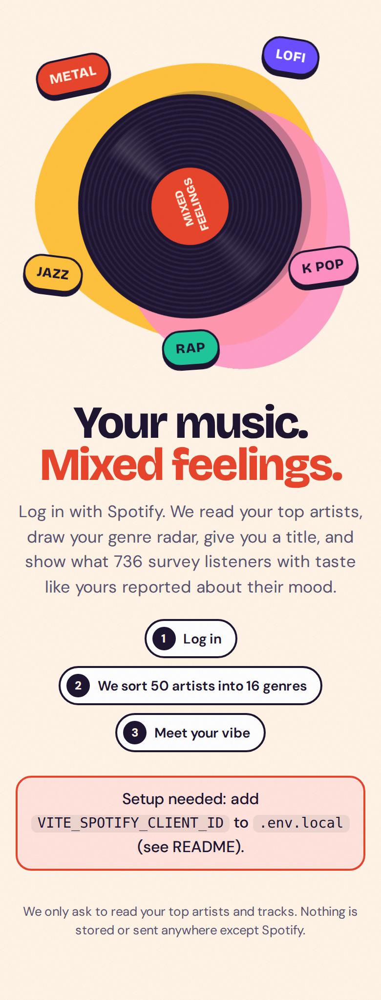
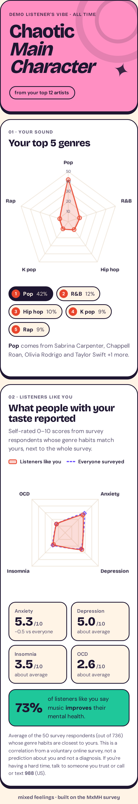

# Mixed Feelings 🎧

Log in with Spotify, and the app reads your top 50 artists and gives you:

1. **A genre radar** of your top 5 genres, using the 16 broad genres from the MxMH survey
2. **A title** like "Moody Metalhead" (reroll with the dice)
3. **A "listeners like you" radar** of the anxiety, depression, insomnia, and OCD scores
   that survey respondents with similar genre habits reported, next to the whole-survey average

<p> </p>

Built for CDC UNC 2026. React + Vite + Chart.js, 100% in the browser (no server).

---

## Run it locally (5 minutes)

### 1. Create the Spotify app (one person, **with Spotify Premium**)
1. Go to <https://developer.spotify.com/dashboard> → **Create app**.
2. **Redirect URIs**: add both
   - `http://127.0.0.1:5173/` (local dev; Spotify rejects `localhost`)
   - `https://<github-user>.github.io/<repo-name>/` (the deployed site)
3. **Which API/SDKs**: tick **Web API**. Save.
4. **User Management**: add the name + Spotify email of everyone who will log in.
   **Dev-mode apps allow max 5 users** (Spotify's Feb 2026 rules), and the app owner must keep Premium.
5. Copy the **Client ID** (not the secret; we don't need it).

### 2. Get a Last.fm API key (1 minute, free)
Spotify has **deprecated artist genres**, and for new apps they usually come back empty.
The app fills them in from Last.fm instead.
1. Go to <https://www.last.fm/api/account/create> and sign in or sign up.
2. Fill in any application name, leave the callback URL blank, and submit.
3. Copy the **API key** (not the shared secret).

Without a key the app falls back to MusicBrainz, which is slow (1 lookup per second) and only covers your top 15 artists.

### 3. Start the app
```bash
cd codebase/website/mixed-feelings_cd/web
cp .env.example .env.local        # paste the Spotify Client ID + Last.fm key into it
npm install
npm run dev                       # opens http://127.0.0.1:5173/
```

**No Spotify slot? Use fake data (dev only):** open
`http://127.0.0.1:5173/?mock=metal` (or `?mock=pop`, `?mock=mixed`, or `?mock=nogenres` to simulate Spotify sending no genres). This is stripped out of the production build.

## Deploy (GitHub Pages)
The workflow `.github/workflows/deploy-web.yml` (at the repo root) builds and publishes on every push to `main`.
One-time setup in the repo:
- **Settings → Pages → Source:** GitHub Actions
- **Settings → Secrets and variables → Actions → Variables:** add `SPOTIFY_CLIENT_ID` and `LASTFM_API_KEY`

Site URL: `https://<github-user>.github.io/<repo-name>/`, which must match the redirect URI above exactly (trailing slash included).

---

## How it works

```
Spotify top 50 artists
   │  src/lib/genreSources.js  genres: Spotify → Last.fm tags → MusicBrainz (cached)
   │  src/lib/genreMap.js   "atl hip hop" → Hip hop, "latin trap" → Latin + ½ Rap …
   ▼
16-genre listening shares ── top 5 → genre radar + title (src/lib/title.js)
   │  src/lib/profile.js    shares → Never / Rarely / Sometimes / Very frequently (0–3)
   ▼
same scale as the survey rows
   │  src/model/            ← swap point for your team's model
   ▼
Anxiety / Depression / Insomnia / OCD (0–10) → second radar
```

| File | What it does |
|---|---|
| `src/lib/spotify.js` | PKCE login, fetches `/me`, `/me/top/artists`, `/me/top/tracks` (4 weeks / 6 months / all time) |
| `src/lib/genreSources.js` | Fills in genres Spotify no longer sends (Last.fm, then MusicBrainz) |
| `src/lib/genreMap.js` | Rules mapping Spotify micro-genres to the survey's 16. Each tag goes to its nearest genre, plus a neighbour at half weight when it straddles two. Unknown tags borrow the artist's other genres. |
| `src/lib/profile.js` | Weights artists by rank (+ top-track appearances), builds the 16-genre profile |
| `src/lib/title.js` | Adjective (from genre #2 or how varied you are) + noun (from genre #1). Never uses the mental-health results. |
| `src/model/index.js` | **Model registry**: `ACTIVE_MODEL` picks which one runs |
| `src/model/knn.js` | Default: average of the 50 closest survey respondents |
| `src/model/linear.js` | Reads coefficients from `src/data/linear_model.json` |
| `scripts/build_data.py` | CSV → `src/data/survey.json` + a sample `linear_model.json` |
| `scripts/check.mjs` | Runs the whole pipeline on the mock listeners (`npm run check`) |

### Plugging in a better model
The results page has an **Under the hood** panel that shows the exact profile fed to the model, and lets you switch models live.

- **Linear / ridge / lasso / logistic-style:** write your coefficients into `src/data/linear_model.json`
  (`{ conditions: { Anxiety: { intercept, coef: { Rock: 0.12, … } }, … } }`, with features on the 0–3 scale)
  and set `ACTIVE_MODEL = 'linear'`. No other code changes.
- **Anything else** (clusters, trees, …): add `src/model/yourModel.js` exporting
  `predict(profile) → { scores, baseline, improveShare?, method }` and register it in `MODELS`.
  `profile.levels` (0–3 per genre) and `profile.shares` (0–1 per genre) are available.
- Re-generate the survey data after cleaning changes: `npm run data` (needs pandas + numpy).

### Honest-framing rules we agreed on
- Results are phrased as "listeners like you reported…", never "you have…"
- Always show the whole-survey average next to it
- Note that it's a voluntary survey (736 people), correlation only, not a diagnosis
- The title never uses the mental-health results

## Known limits
- **5 Spotify accounts max** while in development mode. Extended access now requires an established organization, so plan the demo around your 5.
- Spotify's artist `genres` field is deprecated. Genres come from Last.fm; artists with no tags anywhere are skipped and listed in *Under the hood*, along with where each artist's genres came from.
- Apple Music was left out: it needs a paid Apple Developer account and a signed server token, and has no "top artists over time" endpoint.
- Differences between groups in this survey are small (often < 1 point out of 10), so most people's radar will sit close to the average. That's the real finding, not a bug.
